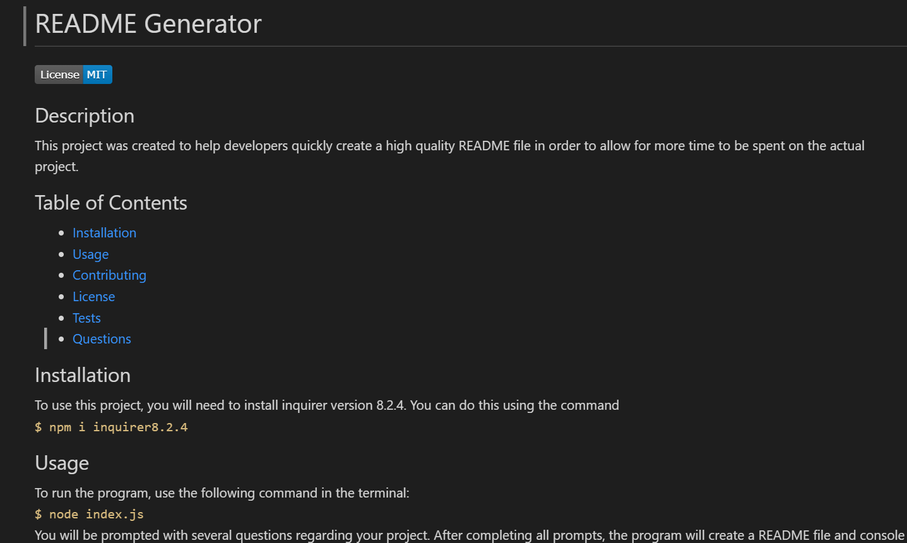
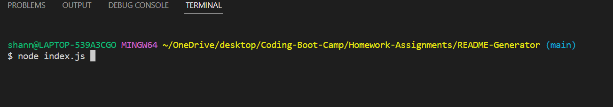
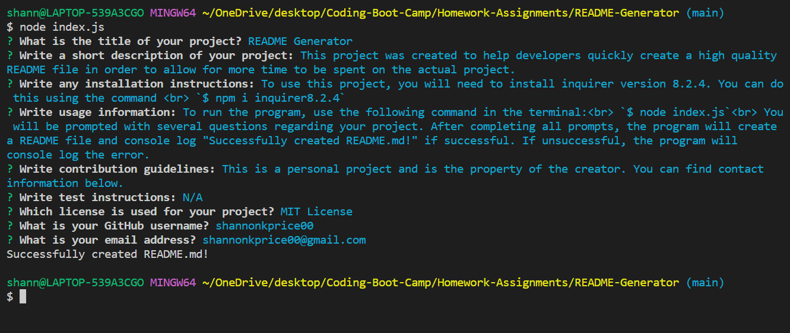

# README-Generator

## Description 
This project was created to help developers quickly create a high-quality README file in order to allow for more time to be spent on the actual project.      
## Table of Contents
- [Installation](#installation)
- [Usage](#usage)
- [Contributing](#contributing)
- [License](#license)
- [Tests](#tests)
- [Questions](#questions)
## Installation
To use this project, you will need to install inquirer version 8.2.4 as a dependency. You can do this by using the following command in the terminal:   `$ npm i inquirer@8.2.4` 
## Usage
This README file was generated using this application. You can view a video demonstration of its creation [here.](https://drive.google.com/file/d/1hKJ-LNOMIEcESW46avyd4fXJw4E0bNFH/view?usp=share_link)  If you know how you would like your formatting (where you want screenshots, page breaks, git commands, etc.) you can add them within the prompts as shown in the video. If you are not yet certain of the formatting you would like, you can use this application to generate all the main information and functionality you need for a high-quality README file with built-in features such as a functioning table of contents.     To run the program, use the following command in the terminal:  `$ node index.js`          You will be prompted with several questions regarding your project. After completing all prompts, the program will create a README file and console log "Successfully created README.md!" if successful. If unsuccessful, the program will console log the error.       
## License
MIT License
## Contributing
This is a personal project and is the property of the creator. You can find contact information below.
## Tests
N/A
## Questions
GitHub Profile: [github.com/shannonkprice00](https://github.com/shannonkprice00) 
For further questions, you can reach me at shannonkprice00@gmail.com
